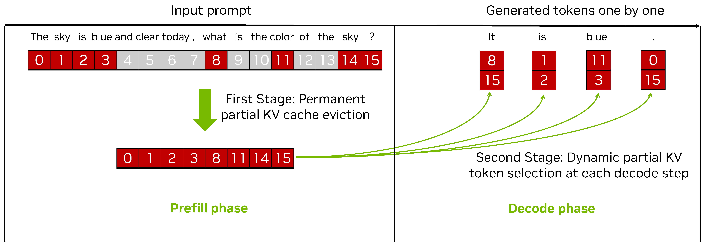
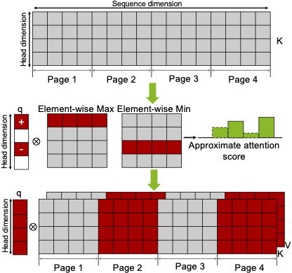

# RocketKV: Accelerating Long-Context LLM Inference via Two-Stage KV Cache Compression 

 This is the official implementation of the above RoketKV paper published at ICML'25. ([arxiv link](https://arxiv.org/abs/2502.14051)). 


## TL;DR
- **Training-free** KV cache compression method for accelerating the decode phase of LLM inference
- **Negligible accuracy drop** at low token budget (e.g., 256 and 512 tokens)
- **End-to-end speedup** by up to **3.7×**, as well as **peak memory reduction** by up to **32.6%** at the decode phase on an **NVIDIA A100 GPU**

## Abstract
Transformer-based Large Language Models rely critically on the KV cache to efficiently handle extended contexts during the decode phase. Yet, the size of the KV cache grows proportionally with the input length, burdening both memory bandwidth and capacity as decoding progresses. To address this challenge, we present RocketKV, a training-free KV cache compression strategy containing two consecutive stages. In the first stage, it performs coarse-grain permanent KV cache eviction on the input sequence tokens. In the second stage, it adopts a hybrid sparse attention method to conduct fine-grain top-k sparse attention, approximating the attention scores by leveraging both head and sequence dimensionality reductions. We show that RocketKV provides a compression ratio of up to 400×, end-to-end speedup of up to 3.7× as well as peak memory reduction of up to 32.6% in the decode phase on an NVIDIA A100 GPU compared to the full KV cache baseline, while achieving negligible accuracy loss on a variety of long-context tasks. We also propose a variant of RocketKV for multi-turn scenarios, which consistently outperforms other existing methods and achieves accuracy nearly on par with an oracle top-k attention scheme.

## RocketKV

Two-stage KV cache compression for decode acceleration.    

First stage (SnapKV): Removes coarse-grain KV tokens with low importance while trying to keep the important tokens.

Second stage (Hybrid Sparse Attention): It conducts fine-grain dynamic KV token selection on the remaining KV tokens followed by top-k attention score.


<div align="center">
  
  <br>
  <em>Overview of RocketKV with two consecutive stages.</em>
</div>

In Hybrid Sparse Attention, the K-tensor is compressed along the sequence dimension first for auxiliary storage, and then selectively fetched along the head dimension for approximation attention calculation.

<div align="center">
  
  <br>
  <em>Illustration of hybrid sparse attention</em>
</div>


## Environment Setup


```
pip install -r requirements.txt
pip install flash-attn==2.6.3
```

---

## Dataset Preparation

The [LongBench](https://github.com/THUDM/LongBench) dataset can be downloaded via the following script:

```
python scripts/dataset_prep/download_longbench.py
```

The Needle-in-a-Haystack dataset is already included in the repo and requires no extra preparation.
The [RULER](https://github.com/NVIDIA/RULER) dataset is already included but needs some extra preparation below:

```
bash scripts/dataset_prep/download_ruler.sh
```
The [SCBench](https://github.com/microsoft/MInference/tree/main/scbench) dataset can be downloaded via the following script:

```
python scripts/dataset_prep/download_scbench.py
```


## Model Preparation

We conduct our accuracy experiments on three widely used long-context models: Llama3.1-8B-Instruct (AI@Meta, 2024), Mistral-7B-Instruct-v0.2 (Jiang et al., 2023), and LongChat-7B-v1.5-32k (Li et al., 2023). These models are automatically downloaded via Huggingface, so please update your Huggingface access token under [`config/access_tokens.py`](https://gitlab-master.nvidia.com/yfu/skillm/-/blob/main/config/access_tokens.py?ref_type=heads).

For efficiency experiments, we use Llama3.1-8B-instruct only, and the model needs to be downloaded via Huggingface first and then converted with the following script:

```
bash scripts/dataset_prep/download_gpt_fast.sh
```


---

## How to Run:
### LongBench

```bash
bash scripts/longbench/llama3.1-8b-instruct.sh rocket <results_dir> <token_budget>
bash scripts/longbench/mistral-7b-instruct-v0.2.sh rocket <results_dir> <token_budget>
bash scripts/longbench/longchat-7b-v1.5-32k.sh rocket <results_dir> <token_budget>
```
You can replace rocket with other methods (Full-KV: baseline, Exact-TopK: topk). If you use "baseline" instead of "rocket", there is no <token_budget>.


### Needle in a Haystack (NIAH)

```bash
bash scripts/paulgraham_passkey/llama3.1-8b-instruct.sh rocket <results_dir> <token_budget>
bash scripts/paulgraham_passkey/mistral-7b-instruct-v0.2.sh rocket <results_dir> <token_budget>
bash scripts/paulgraham_passkey/longchat-7b-v1.5-32k.sh rocket <results_dir> <token_budget>
```

### RULER
```bash
bash scripts/ruler/llama3.1-8b-instruct.sh rocket <results_dir> <token_budget>
bash scripts/ruler/mistral-7b-instruct-v0.2.sh rocket <results_dir> <token_budget>
bash scripts/ruler/longchat-7b-v1.5-32k.sh  rocket <results_dir> <token_budget>
```

### SCBench
```bash
bash scripts/scbench/llama3.1-8b-instruct.sh rocket <results_dir> <token_budget>
```

### Efficiency

```bash
bash scripts/efficiency/llama3.1-8b-instruct.sh rocket <results_dir> <token_budget>
```

## Citation

Should you need to refer to this work or find our codebase useful, please consider citing our work as:


```
@inproceedings{
behnam2025rocketkv,
title={Rocket{KV}: Accelerating Long-Context {LLM} Inference via Two-Stage {KV} Cache Compression},
author={Payman Behnam and Yaosheng Fu and Ritchie Zhao and Po-An Tsai and Zhiding Yu and Alexey Tumanov},
booktitle={Forty-second International Conference on Machine Learning},
year={2025},
url={https://openreview.net/forum?id=RyOpooIxDF}
}
```

## Related Projects
We utilize evaluation frameworks from [longctx_bench](https://github.com/henryzhongsc/longctx_bench) for our accuracy evaluation and 
[gpt-fast](https://github.com/pytorch-labs/gpt-fast) for efficiency evaluation. We also utilize codebase for [RULER](https://github.com/NVIDIA/RULER), [SCBench](https://github.com/microsoft/MInference/tree/main/scbench) and [LongBench](https://github.com/THUDM/LongBench) benchmark. For implementation of RocketKV and other methods, we adapts code snippets from [SnapKV](https://github.com/FasterDecoding/SnapKV), [Quest](https://github.com/mit-han-lab/Quest) and [SparQ](https://github.com/graphcore-research/sparq-gpt-fast).
